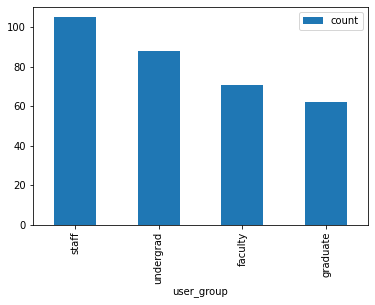

```python
# First we import the "ldlite" package which allows us to use LDLite functions.

import ldlite
```


```python
# We also have to initialize LDLite.  This will create a variable "ld" which we
# can use to call LDLite functions.

ld = ldlite.LDLite()
```


```python
# LDLite must be configured to connect to an Okapi instance and to a database
# that will be used for reporting.  To configure the Okapi connection, we use
# the function "ld.connect_okapi()".

ld.connect_okapi(url='https://folio-juniper-okapi.dev.folio.org/',
                 tenant='diku',
                 user='diku_admin',
                 password='admin')
```


```python
# Next we call "ld.connect_db()" to create a database and connect it to DBLite.
# The database will be stored in a file called "ldlite.db".

db = ld.connect_db(filename='ldlite.db')
```


```python
# The function "ld.query()" is used to send CQL queries to Okapi.  In this case
# we will query patron groups and store the result in a new table named "g".
# In addition to "g", this will create other tables having names beginning with
# "g__t" where JSON data will be transformed to tables.

_ = ld.query(table='g', path='/groups', query='cql.allRecords=1 sortby id')
```

    ldlite: querying: /groups
    ldlite: created tables: g, g__t, g__tcatalog


```python
# We can use "ld.select()" to show a quick view of a table, in this case table
# "g".

ld.select(table='g', limit=10)
```

     __id |                          jsonb                          
    ------+---------------------------------------------------------
        1 | { 
          |     "group": "staff", 
          |     "desc": "Staff Member", 
          |     "id": "3684a786-6671-4268-8ed0-9db82ebca60b", 
          |     "expirationOffsetInDays": 730, 
          |     "metadata": { 
          |         "createdDate": "2021-09-20T01:53:31.055+00:00", 
          |         "updatedDate": "2021-09-20T01:53:31.055+00:00" 
          |     } 
          | } 
        2 | { 
          |     "group": "faculty", 
          |     "desc": "Faculty Member", 
          |     "id": "503a81cd-6c26-400f-b620-14c08943697c", 
          |     "expirationOffsetInDays": 365, 
          |     "metadata": { 
          |         "createdDate": "2021-09-20T01:53:31.084+00:00", 
          |         "updatedDate": "2021-09-20T01:53:31.084+00:00" 
          |     } 
          | } 
        3 | { 
          |     "group": "graduate", 
          |     "desc": "Graduate Student", 
          |     "id": "ad0bc554-d5bc-463c-85d1-5562127ae91b", 
          |     "metadata": { 
          |         "createdDate": "2021-09-20T01:53:31.108+00:00", 
          |         "updatedDate": "2021-09-20T01:53:31.108+00:00" 
          |     } 
          | } 
        4 | { 
          |     "group": "undergrad", 
          |     "desc": "Undergraduate Student", 
          |     "id": "bdc2b6d4-5ceb-4a12-ab46-249b9a68473e", 
          |     "metadata": { 
          |         "createdDate": "2021-09-20T01:53:31.123+00:00", 
          |         "updatedDate": "2021-09-20T01:53:31.123+00:00" 
          |     } 
          | } 
    (4 rows)
    


```python
# When ld.query() created table "g", it also created another table
# "g__t" with JSON fields extracted into columns.

ld.select(table='g__t', limit=10)
```

     __id |                  id                  |         desc          | expiration_offset_in_days |   group   
    ------+--------------------------------------+-----------------------+---------------------------+-----------
        1 | 3684a786-6671-4268-8ed0-9db82ebca60b | Staff Member          |                       730 | staff     
        2 | 503a81cd-6c26-400f-b620-14c08943697c | Faculty Member        |                       365 | faculty   
        3 | ad0bc554-d5bc-463c-85d1-5562127ae91b | Graduate Student      |                           | graduate  
        4 | bdc2b6d4-5ceb-4a12-ab46-249b9a68473e | Undergraduate Student |                           | undergrad 
    (4 rows)
    


```python
# We will also query user data and store the result in table "u" etc.

_ = ld.query(table='u', path='/users', query='cql.allRecords=1 sortby id')
```

    ldlite: querying: /users
    ldlite: created tables: u, u__t, u__t__departments, u__t__personal__addresses, u__t__proxy_for, u__tcatalog


```python
# We can now join table "u" to table "g" and generate a list of user names and
# their associated group.  The result will be stored in a new table
# "user_groups".

cur = db.cursor()

cur.execute("""
    CREATE TABLE user_groups AS
    SELECT u__t.id, u__t.username, g__t.group
        FROM u__t
            JOIN g__t ON u__t.patron_group = g__t.id;
    """)

ld.select(table='user_groups', limit=10)
```

                      id                  | username |   group   
    --------------------------------------+----------+-----------
     00bc2807-4d5b-4a27-a2b5-b7b1ba431cc4 | sallie   | faculty   
     011dc219-6b7f-4d93-ae7f-f512ed651493 | elmer    | staff     
     01b9d72b-9aab-4efd-97a4-d03c1667bf0d | rick1    | graduate  
     0414af69-f89c-40f2-bea9-a9b5d0a179d4 | diana    | faculty   
     046353cf-3963-482c-9792-32ade0a33afa | jorge    | faculty   
     04e1cda1-a049-463b-97af-98c59a8fd806 | nicola   | undergrad 
     066795ce-4938-48f2-9411-f3f922b51e1c | arlo     | graduate  
     07066a1f-1fb7-4793-bbca-7cd8d1ea90ab | vergie   | faculty   
     08522da4-668a-4450-a769-3abfae5678ad | johan    | staff     
     0a246f61-d85f-42b6-8dcc-48d25a46690b | maxine   | staff     
    (10 rows)
    


```python
# The "user_groups" table can also be exported to a CSV or Excel file.

ld.export_csv(table='user_groups', filename='user_groups.csv')

ld.export_excel(table='user_groups', filename='user_groups.xlsx')
```


```python
# We can look at the distribution of groups.

df = cur.execute("""
    SELECT coalesce("group", 'unknown') AS user_group,
       count(*) AS count
    FROM user_groups
    GROUP BY user_group
    ORDER BY count DESC;
    """).fetchdf()

print(df)
```

      user_group  count
    0      staff    105
    1  undergrad     88
    2    faculty     71
    3   graduate     62


```python
# We can plot the distribution with a bar graph.

import matplotlib

_ = df.plot(kind='bar', x='user_group')
```


    

    


```python
# Or a pie chart.

_ = df.plot(kind='pie', x='user_group', y='count')
```


    

    

